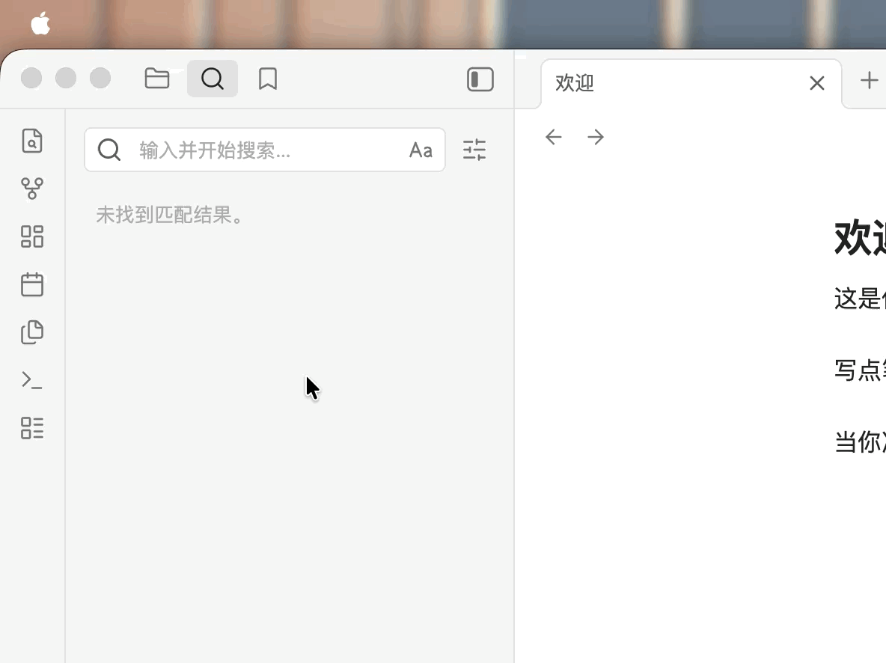

# Unified Chinese-Characters Searcher (UCCS)

> **Automatically match Simplified and Traditional Chinese in Obsidian's global search — type any Chinese character and find all variant results across regions.**


[](https://ko-fi.com/omgyork)

---

## Demo



---

## Overview

UCCS is an Obsidian plugin that expands your search query in real time to cover both Simplified and Traditional Chinese character variants. When you type a keyword in global search (`Cmd+Shift+F`), the plugin automatically generates an `OR` query with all relevant character variants, so you never miss a note due to font or regional differences.

It supports four mapping modes: Simplified↔Traditional (Hong Kong), Simplified↔Traditional (Taiwan), All Regions, and Traditional HK↔Traditional TW.

---

## 功能

當你在 Obsidian 全局搜索（`Cmd+Shift+F`）中輸入關鍵詞時，插件會自動將中文字符擴展為**簡體 + 繁體**兩種寫法，確保不漏掉任何筆記。

| 輸入 | 實際搜索 | 匹配結果 |
|------|---------|---------|
| `剑法` | `(剑法) OR (劍法)` | 同時命中「剑法」和「劍法」 |
| `龍門` | `(龍門) OR (龙门)` | 同時命中兩種寫法 |
| `學習 Python` | `(學習) OR (学习) Python` | 英文保持不變 |

## 安裝

1. 下載最新的 [Release](https://github.com/Yorkli1/Unified-Chinese-characters-Searcher/releases)
2. 解壓到你的 vault：`.obsidian/plugins/simplified-traditional-search/`
3. Obsidian → 設定 → 第三方插件 → **重新載入插件**
4. 啟用 **Unified Chinese-characters Searcher (UCCS)**

## 設定

| 選項 | 說明 |
|------|------|
| **啟用插件** | 一鍵開關 |
| **映射地區** | 簡體<->繁體（香港）/（台灣）/ 全部地區 / 繁體HK<->繁體TW |
| **展開延遲** | 打字停頓後多少毫秒展開（預設 800ms） |
| **轉換運算符值** | 是否同時轉換 `path:`、`tag:` 等運算符後的值 |
| **短語/成語轉換** | 開啟成語、慣用語也會被轉換（預設關閉） |

## 支援

如果你覺得這個插件有用，歡迎請我喝杯咖啡 ☕

[](https://ko-fi.com/omgyork)

## 開發

```bash
git clone https://github.com/Yorkli1/Unified-Chinese-characters-Searcher.git
cd Unified-Chinese-characters-Searcher
npm install
npm run dev      # 開發模式（watch）
npm run build    # 生產構建
```

字符映射表從 OpenCC 官方數據庫生成：
```bash
python3 scripts/gen_mappings.py
```

## 許可證

Apache License 2.0。字符映射數據源於 [OpenCC](https://github.com/BYVoid/OpenCC)（Apache License 2.0）——從其官方字典文件提取簡繁及地區變體映射，本插件僅做格式轉換，不修改原始映射關係。

---

*本專案由 AI 助手 Hermes 協助開發。*
